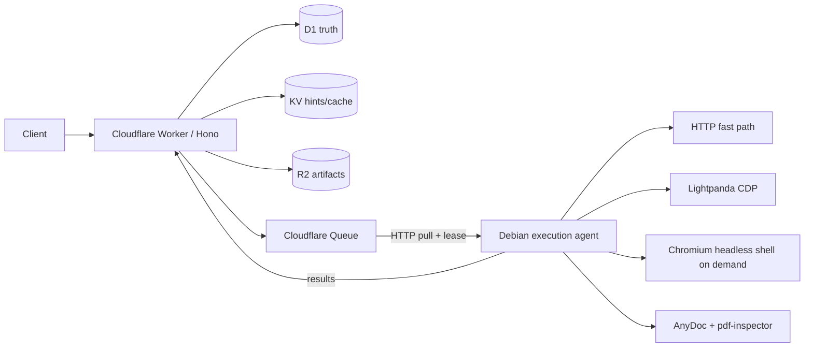

# Feather Runtime

Feather Runtime is a lightweight, Cloudflare-driven Web and Document Automation Runtime designed for a small Debian execution node (2 vCPU / 2 GB RAM). The VPS supplies compute; Cloudflare supplies authoritative state, durable objects, queue delivery, and the public control plane.

The default execution policy is deliberately asymmetric:

```text
HTTP fast path -> Lightpanda -> Chromium Headless Shell

Document -> local parser -> OCR-required signal
```

Chromium is a fallback, not an idle service.

## Architecture



See [docs/architecture.md](docs/architecture.md) for the full state, retry, and failure model.

Actual implementation/deployment test evidence is recorded in [docs/verification.md](docs/verification.md). It explicitly marks each scenario as passed, partial, or not executed.

### Operator-only final verification

One check intentionally requires an operator to hold the same temporary bootstrap secret on both sides of the registration flow. The assistant execution environment cannot safely round-trip that reusable secret, so the repository includes a one-command verification harness instead:

```bash
export CLOUDFLARE_API_TOKEN='<token with Workers Scripts, D1, R2 and Queues edit>'
bash scripts/verify-agent-e2e.sh
```

The script:

- refuses to run unless the Feather Queue is initially empty;
- generates temporary bootstrap, node-HMAC and admin API credentials without printing them;
- rotates the Worker `BOOTSTRAP_TOKEN` to the temporary value via Wrangler;
- starts the actual Lightpanda + final Agent Docker image;
- verifies registration, signed heartbeat, Queue pull/ack and real HTTP, Lightpanda and Chromium tasks;
- verifies result artifacts through remote R2 and node state through remote D1;
- removes test containers, task rows, API key, node row and R2 objects;
- finally rotates `BOOTSTRAP_TOKEN` again to a fresh unknown value so the temporary enrollment credential is invalidated.

The checked-in defaults point at the currently deployed Feather resources. Override `CONTROL_PLANE_URL`, `CF_ACCOUNT_ID`, `CF_QUEUE_ID`, `CF_QUEUE_NAME`, `D1_DATABASE` or `R2_BUCKET` if you deploy another environment. Set `CF_QUEUES_TOKEN` separately if you want the Agent to use a narrower Queue-only token instead of `CLOUDFLARE_API_TOKEN` during this one-shot verification.

Formatting is the other operator-side write step. DevSpace allows source changes only through its file mutation API, so the mechanical repository-wide Prettier rewrite is provided as:

```bash
bash scripts/format-source.sh
```

## Current verified dependency baseline

The project was implemented against the live package/release state on 2026-08-16:

- Node.js 24 LTS runtime for the reference Agent image.
- Hono 4.13.x.
- Wrangler 4.123.x.
- Lightpanda 0.3.7 (official Docker tag exists).
- `@firecrawl/anydoc` 0.1.9, Node >=20, MIT.
- `@firecrawl/pdf-inspector` 1.14.2, MIT.
- Puppeteer Core 25.7.x.
- Chrome for Testing / Headless Shell 152.0.7977.42.

Cloudflare HTTP pull consumers are configured with Wrangler CLI/API rather than a `queues.consumer` entry in `wrangler.jsonc`. This matches Cloudflare's current pull-consumer semantics.

## Repository layout

```text
apps/
  control-plane/       Cloudflare Worker / Hono API
  execution-agent/    Debian Node.js agent
packages/
  protocol/            Zod wire schemas + task state machine
  database/            repository interfaces + D1 repository
  browser-core/        HTTP, confidence, routing, Lightpanda, Chromium
  document-core/       AnyDoc / pdf-inspector adapters
  shared/              errors, HMAC, redaction, SSRF primitives
migrations/            D1 migrations
infra/docker/          Dockerfile + Compose
infra/systemd/         native service units
scripts/               provisioning/deploy/native install helpers
tests/fixtures/         browser routing fixtures
docs/                  architecture, security, troubleshooting, OpenAPI
```

## Prerequisites

- Node.js 22 or newer supported LTS; Node.js 24 is the preferred runtime.
- Corepack and pnpm 11.22.x.
- A Cloudflare account with Workers, D1, KV, R2, and Queues.
- For HTTP pull: a narrowly scoped Queues token with read + write (ack mutates queue state).
- Debian 12/13 x86-64 for the reference agent image/native deployment.

## Local development

```bash
corepack pnpm install
corepack pnpm typecheck
corepack pnpm test
```

For local Worker development:

```bash
cp .dev.vars.example .dev.vars
corepack pnpm --filter @feather/control-plane dev
```

Use `AUTH_DISABLED=1` only in an isolated local environment. Production configuration must leave it disabled.

## Cloudflare provisioning

Create the resources:

```bash
bash scripts/provision-cloudflare.sh
```

Resource names are centralized:

```text
feather-runtime-db
feather-runtime-cache
feather-runtime-artifacts
feather-runtime-jobs
feather-runtime-jobs-dlq
```

Copy the D1 `database_id` and KV namespace ID into `apps/control-plane/wrangler.jsonc`. R2 and Queue bindings use resource names.

Generate secrets without committing them:

```bash
openssl rand -hex 32                     # BOOTSTRAP_TOKEN or API_HASH_PEPPER
openssl rand -base64 32                  # NODE_KEY_ENCRYPTION_KEY (exactly 32 decoded bytes)
```

Set Worker secrets:

```bash
cd apps/control-plane
corepack pnpm exec wrangler secret put BOOTSTRAP_TOKEN
corepack pnpm exec wrangler secret put NODE_KEY_ENCRYPTION_KEY
corepack pnpm exec wrangler secret put API_HASH_PEPPER
```

Apply migrations, deploy, and attach the HTTP pull consumer:

```bash
bash scripts/deploy-cloudflare.sh
```

The pull consumer is configured with batch size 4, 3 retries, a DLQ, a 300 second visibility timeout, and a 5 second retry delay. Change these deliberately for workloads that can exceed five minutes.

## Create a public API token

The public API stores only a peppered SHA-256 token hash. Generate a random token, compute:

```text
SHA256(API_HASH_PEPPER + ":" + TOKEN)
```

and insert that hash into `api_keys` with scopes such as:

```text
tasks:read tasks:write artifacts:read
```

Admin endpoints require `admin`.

For initial provisioning you can instead call `POST /internal/bootstrap/api-keys` with `X-Bootstrap-Token`. Supply your own random API token in the request; the Worker hashes it internally with `API_HASH_PEPPER`, so operators do not need to retrieve the pepper from Cloudflare.

## Agent configuration

Create `.env` from `.env.example`. `NODE_SECRET`, `NODE_BOOTSTRAP_TOKEN`, and `CF_QUEUES_TOKEN` are secrets and must not be committed.

Important defaults for a 2C2G node:

```text
MAX_TOTAL_CONCURRENCY=4
MAX_LIGHTPANDA_CONCURRENCY=3
MAX_CHROMIUM_CONCURRENCY=1
MAX_OCR_CONCURRENCY=1
MIN_FREE_MEMORY_MB=350
CRITICAL_FREE_MEMORY_MB=200
```

The agent stops pulling all work below the critical free-memory threshold and refuses new Chromium work below the Chromium threshold.

`CHROMIUM_NO_SANDBOX` defaults to `0`. Keep that default for native/systemd deployment. The reference Docker Compose sets it to `1` because many container hosts disable the user namespace mechanism Chromium needs for its inner Linux sandbox. In that mode the container itself remains unprivileged (`USER node`), uses `no-new-privileges`, PID/memory limits, and an ephemeral `/tmp`; do not copy this setting into a root/native service.

## Docker deployment

```bash
cp .env.example .env
# fill secrets/IDs
docker compose -f infra/docker/docker-compose.yml up -d --build
```

Lightpanda is available only on the Compose network (`expose: 9222`); it is not published on `0.0.0.0`. Chromium Headless Shell is installed in the agent image and launched only for tasks that need it.

Local health check inside the host namespace is provided by the native agent at:

```text
http://127.0.0.1:8788/health
```

For the container deployment this endpoint remains bound to the container loopback unless you intentionally add a loopback-only host publishing rule.

## Native systemd deployment

The reference units live in `infra/systemd/`. `scripts/install-native.sh` installs Chromium dependencies, Chrome Headless Shell, the pinned Lightpanda 0.3.7 release binary, builds the agent, copies the project tree, and installs both units. Run it as root, then place agent configuration at `/etc/feather-runtime/agent.env` and enable:

```bash
systemctl daemon-reload
systemctl enable --now feather-lightpanda feather-agent
```

Reference native install:

```bash
sudo bash scripts/install-native.sh
```

## Public API examples

Create a scrape task:

```http
POST /v1/scrape
Authorization: Bearer <token>
Content-Type: application/json

{
  "url": "https://example.com",
  "format": "markdown",
  "engine": "auto"
}
```

Upload a document directly:

```http
POST /v1/documents
Authorization: Bearer <token>
Content-Type: application/pdf
X-File-Name: paper.pdf

<binary body>
```

Full interface: [docs/openapi.yaml](docs/openapi.yaml).

## Routing behavior

An ordinary scrape starts at HTTP. Confidence considers status, content type, body/text size, readable main content, target selectors, anti-bot markers, and JS-required markers. A score below `HTTP_CONFIDENCE_THRESHOLD` falls forward to Lightpanda. Low Lightpanda render confidence falls to Chromium.

Authentication, payment, destructive operations, and `requires_chromium` domain policies route directly to Chromium. CAPTCHA/MFA/challenge pages are detected as failure conditions; this project does not implement challenge bypass.

## Document behavior

AnyDoc is the primary local document adapter. PDF is pre-classified by `pdf-inspector`:

- Text-based PDF -> local Markdown extraction.
- Scanned/image PDF or pages flagged for OCR -> `OCR_REQUIRED`.

OCR execution is intentionally not bundled into the first-stage agent yet. The adapter boundary and scheduler budget are present so an isolated on-demand OCR subprocess can be added without changing the task protocol.

## Security model

- D1 is authoritative state; KV never provides locks or payment/task truth.
- Internal Agent -> Worker requests use node ID + timestamp + nonce + HMAC-SHA256.
- Node HMAC secrets are AES-GCM encrypted at rest using a Worker secret key.
- Nonces are inserted into D1 to reject replay.
- Public API tokens are stored only as peppered hashes.
- HTTP/navigation URLs reject local/private/metadata targets; redirects are revalidated.
- Logs pass through secret-shaped-key redaction.
- Destructive attempts reserve a D1 idempotency key before execution and never auto-retry after an execution failure.
- Public tasks cannot invoke shell commands.

See [docs/security.md](docs/security.md).

## Failure and retry model

Queue delivery is treated as at-least-once. The agent does not ack a message until the control plane accepts completion/failure state. Duplicate starts race on a conditional D1 lease; only one receives `execute: true`.

Retryable non-destructive failures can create a new attempt. Destructive tasks fail closed. Task events are append-only for inspection.

## Upgrade

1. Drain the node (stop pulling new tasks).
2. Build/test the new commit.
3. Deploy the Worker and migrations.
4. Restart one agent node.
5. Verify `/health`, heartbeats, and a static scrape.
6. Roll remaining nodes.

Agents report a version and node capabilities to D1 so mixed-version fleets are visible.

## Current MVP boundary

Implemented in source: D1 schema/state, Queue producer + HTTP pull client, HMAC/replay defense, HTTP extraction, Lightpanda and on-demand Chromium adapters, progressive fallback, AnyDoc/pdf-inspector, R2 artifact upload/download, heartbeat/node registry, memory/concurrency guards, cancellation checks between browser actions, Docker/systemd deployment, OpenAPI, and unit fixtures.

Explicitly second stage: encrypted persistent browser-profile synchronization, a real OCR subprocess adapter, learned domain-engine stats updates, metrics export/dashboard, and full multi-node drain orchestration.

Do not treat a feature as verified merely because an interface exists. The final verification report should distinguish `passed`, `failed`, and `not executed`.
