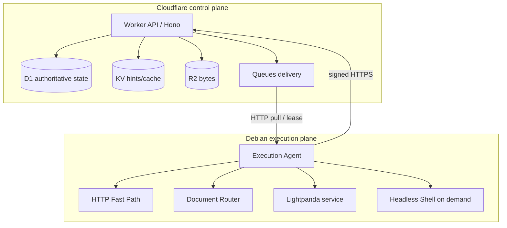
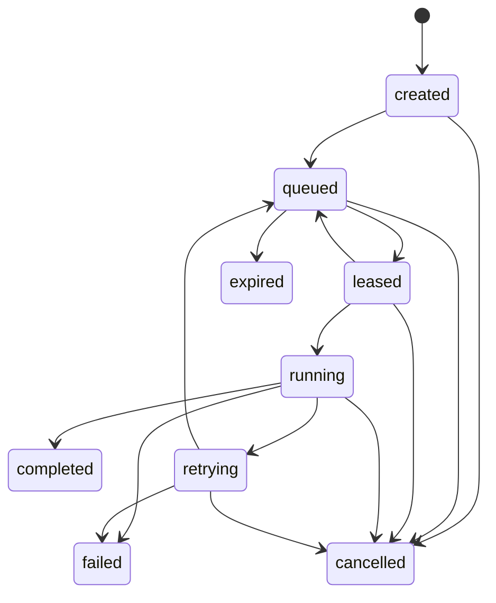
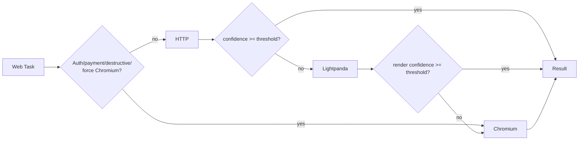
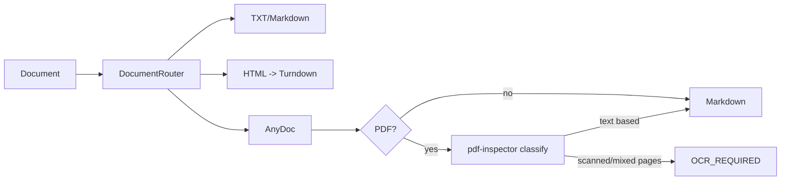

# Architecture

## Responsibility split



D1 is truth. KV is disposable. R2 stores bytes. Queues delivers work. The VPS may be destroyed without losing task definitions, event history, or primary artifacts.

## Task lifecycle



The queue message carries only task/attempt identity. The agent retrieves the task body from the Worker so queue messages stay small and task state remains centralized.

## Attempt and duplicate semantics

Every queue delivery references a `task_attempts` row and unique `idempotency_key`. Starting work performs a conditional D1 lease. A duplicate delivery that arrives after a lease was won gets `execute: false` and is safe to acknowledge.

For destructive work, `destructive_idempotency` is reserved before execution. Destructive failures are not automatically retried. If completion is uncertain, the row can remain/transition to `unknown` and requires reconciliation rather than a second click/payment/submit.

## Engine routing



Domain policy can disable an engine or force one. KV may supply a high-confidence engine hint, but policy and authoritative task flags win.

## Document routing



The OCR-required branch is a deliberate interface boundary in MVP. A future adapter should run as a resource-limited subprocess and terminate after the job.

## Artifacts

Large bodies never live in D1. R2 keys are grouped by task/attempt. D1 stores only metadata, hashes, MIME, byte count, and R2 key. Current internal upload keys follow:

```text
users/{userId|system}/tasks/{taskId}/attempts/{attemptId}/{artifactId}-{filename}
users/{userId|system}/tasks/{taskId}/source/{artifactId}-{filename}
```

## Queue ordering and acknowledgement

The agent uses the current Cloudflare HTTP pull endpoints:

```text
POST /accounts/{account}/queues/{queue}/messages/pull
POST /accounts/{account}/queues/{queue}/messages/ack
```

Pulled messages are leased by `lease_id`. The agent acknowledges only after D1/R2 reporting succeeds. Reporting failure causes explicit retry or natural redelivery when the visibility timeout expires.

## Resource guards

The 2C2G default has independent limits for total work, Lightpanda, Chromium, and OCR. Chromium concurrency defaults to one. The agent also inspects system free memory before pulling and before Chromium startup.

## Future-compatible boundaries

Repositories isolate D1-specific persistence from task/domain logic. `BrowserEngine` isolates browser CDP implementation. `DocumentParser` isolates AnyDoc/PDF/OCR choices. These are intended extension points for Supabase/Postgres, remote Chromium, Playwright/WebKit/Firefox, GPU OCR nodes, or Cloudflare Workflows without adding those dependencies to MVP.
